# AgileSoftwareEngineeringAndDevOps-CSC4307-Docker #
## Docker Definition ##
Docker is an open-source containerization platform. It enables developers to package applications into containers—standardized executable components combining application source code with the operating system (OS) libraries and dependencies required to run that code in any environment.    

## Docker Client ## 
After installing Docker, we will start playing with it by running some command lines on terminal.  
* run the hello world container   
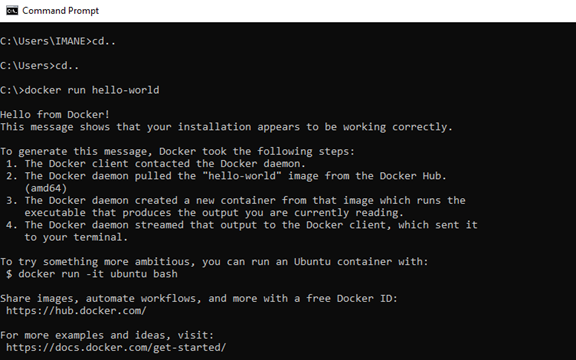   
** Docker images
- Display existing images   
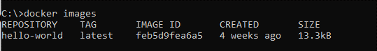   
- Create ubuntu container   
   
•	ubuntu container running in the terminal vs the Docker PS command to look at the running images on terminal   
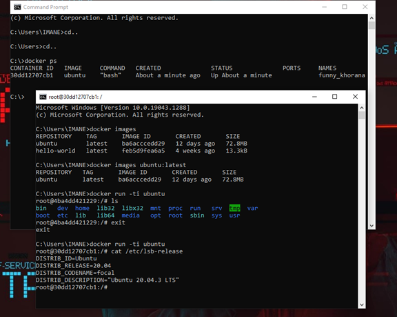  
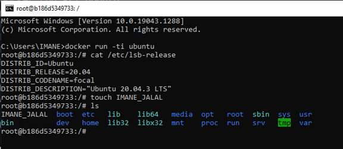   
•	Enter “ls” command to see the file we have just created   
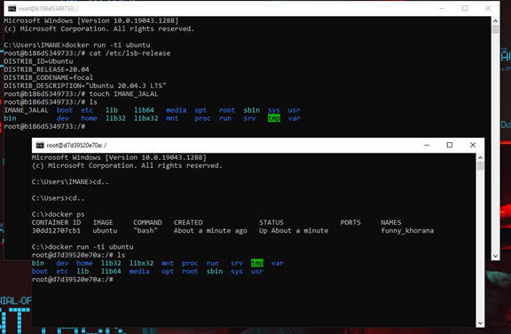   
•	looking at running an image to make a container   
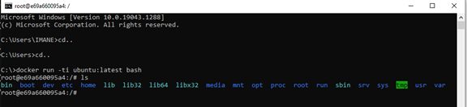   
•	Look at the most recently exited container with the docker “ps” command   
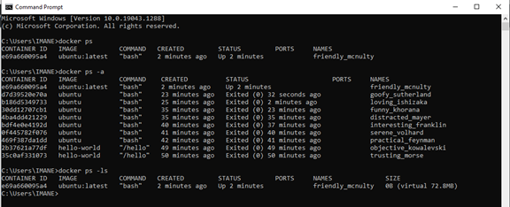   
•	Looking at the most recently exited container   
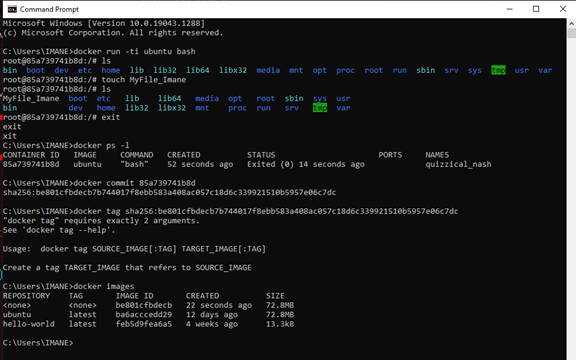  
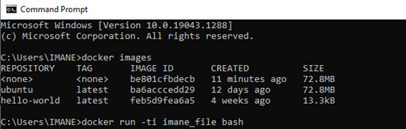   
•	Run processes in containers   
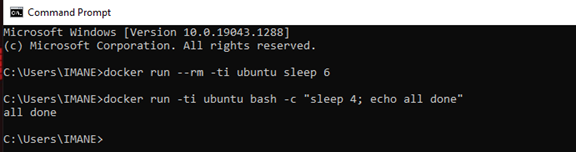  
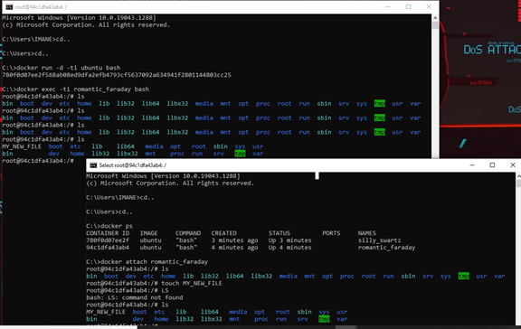  
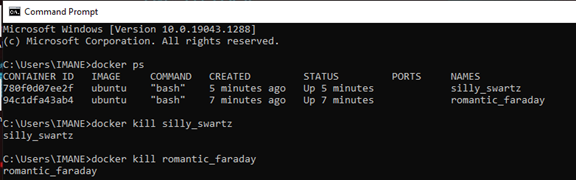  
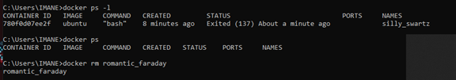   

## Conclusion ## 
Docker images are typically very small, which facilitates rapid delivery and reduces the time to deploy new application containers. Docker reduces effort and risk of problems with application dependencies.  

## WHEN to Contribute? ##
You are ***always welcome*** to contribute.

## HOW to Contribute? ##
- [x] Fork this repository.
- [x] Do your desired changes.
- [x] Make a pull request.
